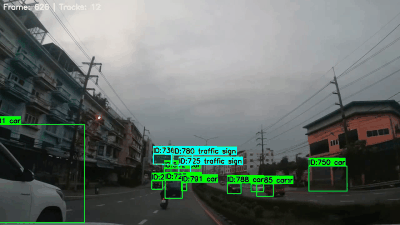
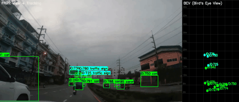

## 🚗 自动驾驶 2D 感知与跟踪系统

端到端感知 Pipeline：**YOLOv8m** → **DeepSORT** → **BEV (IPM)** → **TensorRT 部署**


---

## 🎬 演示

### 多目标跟踪（YOLOv8m + DeepSORT）


### BEV 鸟瞰图（检测 → IPM 俯视投影）


### 单帧检测


---

## ✨ 核心亮点

| 模块 | 做了什么 | 成果 |
|------|----------|------|
| 🎯 **目标检测** | YOLOv8m 在 BDD100K 上自定义训练 | mAP@50 = **0.718**（vs 基线 +6.2%） |
| 🏃 **多目标跟踪** | 集成 DeepSORT（卡尔曼滤波 + ReID） | 遮挡恢复、ID 一致性、视频级验证 |
| 🗺️ **BEV 感知** | IPM 逆透视变换（前视图 → 鸟瞰图） | 轨迹投影 + 相对距离估计 |
| 🚀 **TensorRT 部署** | PyTorch → ONNX → TensorRT FP16 | **280.8 FPS / 4.0× 加速 / 23.8 MB** |

---

## 📊 量化指标

| 指标 | 数值 | 说明 |
|------|:---:|------|
| **mAP@50** | **0.718** | BDD100K 4 类，vs YOLOv8s 基线 0.676 (+6.2%) |
| **PyTorch FPS** | **70.3** | RTX 4070，完整流程（前处理+推理+NMS） |
| **TensorRT FPS** | **280.8** | FP16，RTX 4070 实测 500 帧平均 |
| **加速比** | **4.0×** | 同 GPU、同模型、同 pipeline 的公平对比 |
| **模型大小** | **23.8 MB** | TensorRT FP16 Engine（.pt 原 197.8 MB） |
| **显存占用** | **~1 GB** | YOLOv8m + DeepSORT，8 GB 显卡绰绰有余 |
| **参数量** | **25.9M** | YOLOv8m，精度-速度最优平衡点 |

> ⚠️ **数据可复现**：所有 FPS / 加速比 / 显存均在本地 RTX 4070 实测。RTX 5090 Engine（51 MB FP16）已导出，部署时按目标 GPU 重新构建即可。

---

## 🛠️ 技术栈

| 模块 | 技术 | 说明 |
|------|------|------|
| 检测 | YOLOv8m (Ultralytics) | 25.9M 参数，全系选型（n/s/m/l/x）后选定 |
| 数据集 | BDD100K | 7 万张街景图，筛选 4 类目标 |
| 跟踪 | DeepSORT | 卡尔曼滤波 + MobileNetV2 ReID 外观匹配 |
| BEV | IPM 逆透视变换 | 单应性矩阵投影，前视 → 俯视 |
| 训练 | RTX 5090 云 GPU | AdamW + 余弦退火，60 epochs，7h |
| 部署 | TensorRT 10.x FP16 | CUDA 13.2，完整导出链 |

---

## 🚀 快速开始

```bash
git clone https://github.com/Nefelibata134/autonomous-perception-yolo.git
cd autonomous-perception-yolo
pip install -r requirements.txt

# 单张图检测
python inference.py --source assets/test.jpg

# 视频跟踪
python inference_tracking.py --source assets/test_video.mp4

# BEV 鸟瞰图
python inference_bev.py --source assets/test_video.mp4

# TensorRT 推理（需先导出 Engine）
python inference_trt.py --source assets/test.jpg

# Benchmark
python bench_full_pipeline.py  # 完整 Pipeline 对比
python bench_tensorrt.py       # 纯模型推理对比
python bench_reid.py           # ReID 对比
```

---

## 📁 项目结构

```
autonomous-perception-yolo/
├── assets/                   # 示例图片 / GIF / 视频
│   ├── demo_tracking.gif     # 跟踪演示 GIF
│   ├── demo_bev.gif          # BEV 演示 GIF
│   └── demo_detection.jpg    # 检测截图
├── configs/
│   └── data.yaml             # BDD100K 训练配置
├── data/                     # 数据集（.gitignore）
├── models/
│   ├── yolo_detector.py      # YOLOv8 检测封装
│   ├── deepsort_tracker.py   # DeepSORT 跟踪器
│   └── bev_transform.py      # IPM 鸟瞰图变换
├── utils/
│   ├── dataset_converter.py  # BDD100K JSON → YOLO 格式
│   └── visualize_yolo.py         # 可视化工具
├── runs/detect/              # 训练权重 / Engine / 日志
├── inference.py              # 单图 / 视频推理
├── inference_tracking.py     # 检测 + 跟踪
├── inference_bev.py          # BEV 鸟瞰图
├── inference_trt.py          # TensorRT 推理
├── train.py                  # 训练脚本
├── train_v2_optimized.py     # 优化训练（100 epoch）
├── export_deploy.py          # ONNX / TensorRT 导出
├── bench_full_pipeline.py    # 完整 Pipeline benchmark
├── bench_tensorrt.py         # 纯模型 PyTorch vs TRT
├── bench_pytorch_pure.py     # 纯 PyTorch benchmark
├── bench_reid.py             # ReID TensorRT benchmark
├── bench_vram2.py            # 显存测量
├── MODEL_COMPARISON.md       # YOLOv8 全系选型分析
├── requirements.txt
└── README.md
```

---

## 📝 开发日志

| 日期 | 里程碑 | 内容 |
|------|--------|------|
| 04-27 | Day 1 | 环境搭建，单张图/视频推理跑通 |
| 04-29 | Day 2 | BDD100K 下载、4 类筛选、JSON → YOLO 格式转换 |
| 05-01 | Day 3 | YOLOv8s 全量训练，mAP@50=0.676（5090 云，3h） |
| 05-02 | Day 4 | DeepSORT 多目标跟踪集成 |
| 05-03 | Day 5 | BEV 鸟瞰图（IPM），前视图+BEV 并排可视化 |
| 05-04 | Day 6 | TensorRT 部署导出，生成 Engine |
| 05-05 | Day 7 | 项目收尾：README / Demo 视频 / 简历 |
| 05-12 | 优化 | YOLOv8s→YOLOv8m，mAP 0.676→0.718 (+6.2%)，参数 11.2M→25.9M |
| 05-23 | 修正 | **重测全部 benchmark**（本地 4070）：TensorRT 280.8 FPS / 4.0× 加速。ReID 也完成 TensorRT 导出 |
| | | **新增**：GIF 演示、显存测量（~1 GB）、完整 benchmark 脚本 |

---

## 📚 参考资料

- [Ultralytics YOLOv8](https://docs.ultralytics.com/)
- [BDD100K Dataset](https://bdd-data.berkeley.edu/)
- [DeepSORT: Simple Online and Realtime Tracking with a Deep Association Metric](https://arxiv.org/abs/1703.07402)
- [Inverse Perspective Mapping](https://en.wikipedia.org/wiki/Inverse_perspective_mapping)

---

## 📧 联系

有问题或建议？欢迎提 [Issue](https://github.com/Nefelibata134/autonomous-perception-yolo/issues)。
