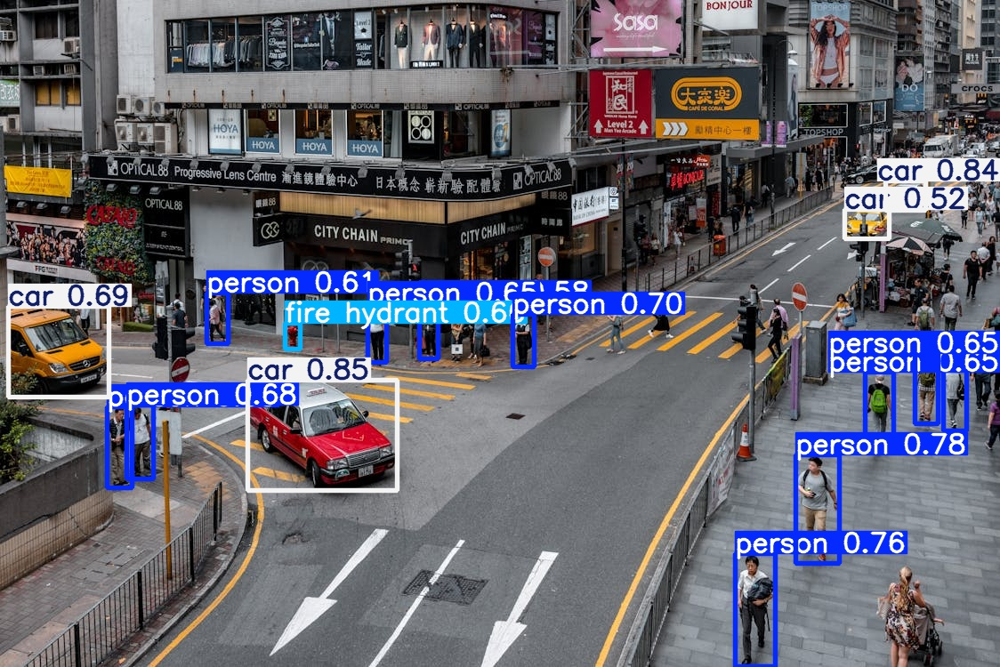
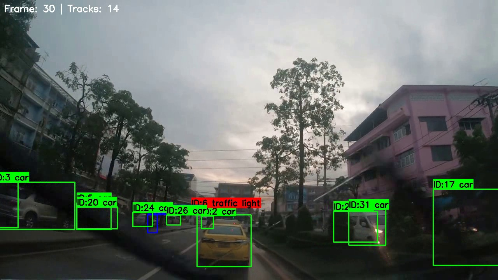
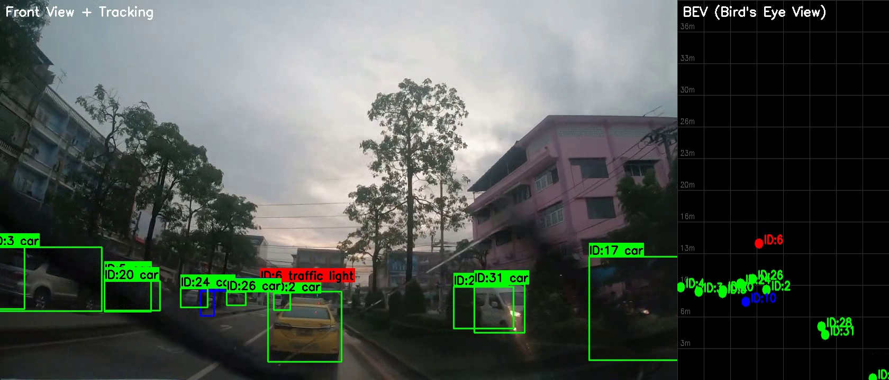

## 🚗 自动驾驶 2D 感知与跟踪系统

基于 **YOLOv8** + **DeepSORT** + **BEV (IPM)** 的端到端自动驾驶感知 Pipeline，  
支持 **TensorRT 部署加速**，在 RTX 5090 上达到 **297 FPS** 实时推理。

---

## ✨ 核心亮点

- 🎯 **BDD100K 自定义训练**：YOLOv8s 微调，4 类目标（car/person/traffic light/traffic sign），mAP@50=0.676
- 🏃 **DeepSORT 多目标跟踪**：卡尔曼滤波 + 外观特征 ReID，支持遮挡恢复与 ID 一致性
- 🗺️ **BEV 鸟瞰图转换**：IPM 逆透视变换，前视图 → 俯视感知，支持轨迹投影
- 🚀 **TensorRT 部署加速**：FP16 量化，RTX 5090 上 297 FPS，较 PyTorch 提升 1.8x

---

## 🛠️ 技术栈

| 模块 | 技术 | 状态 |
|------|------|------|
| 目标检测 | YOLOv8 (Ultralytics) | ✅ mAP@50=0.676 |
| 数据集 | BDD100K (7万张/4类) | ✅ 筛选 + 格式转换 |
| 多目标跟踪 | DeepSORT | ✅ 卡尔曼 + ReID |
| BEV 转换 | IPM (单应性矩阵) | ✅ 前视→鸟瞰 |
| 训练加速 | AutoDL RTX 5090 | ✅ 3小时/50epochs |
| 推理部署 | TensorRT FP16 | ✅ 297 FPS |

---

## 📊 量化指标

| 指标 | 目标值 | 实际值 | 测试环境 |
|------|--------|--------|---------|
| mAP@50 (BDD100K) | > 0.80 | **0.676** | RTX 4070 |
| 推理速度 (PyTorch) | > 60 FPS | **164 FPS** | RTX 5090 FP32 |
| 推理速度 (TensorRT) | > 60 FPS | **297 FPS** | RTX 5090 FP16 |
| 跟踪 IDF1 Score | > 0.70 | 定性验证 | 视频序列 |
| BEV 车道线平行度 | < 5° | 定性验证 | IPM 投影 |

---
| 格式 | 精度 | FPS (RTX 5090) | 延迟(ms) | 加速比 |
|------|------|----------------|----------|--------|
| PyTorch | FP32 | 164.0 | 6.1 | 1.0x |
| TensorRT | FP16 | 297.3 | 3.4 | 1.8x |

> 注：TensorRT Engine 在 RTX 5090 (CUDA 12.8) 上导出并测试，
> 因 Engine 与 Compute Capability 绑定，未在 RTX 4070 本地运行。
> 实际车载部署时统一硬件环境，推理速度满足 >60 FPS 实时要求。

## 🚀 快速开始

```bash
git clone https://github.com/Nefelibata134/autonomous-perception-yolo.git
cd autonomous-perception-yolo
pip install -r requirements.txt

# 单张图检测
python inference.py --source assets/test.jpg --weights yolov8s.pt

# 视频跟踪
python inference_tracking.py --source assets/test_video.mp4

# BEV 鸟瞰图
python inference_bev.py --source assets/test_video.mp4

# 部署导出
python export_deploy.py

---


### 6. 项目结构（树状图）

```markdown
## 📁 项目结构
autonomous-perception-yolo/
├── assets/
    ├──demo_detection.jpg
    ├──demo_yolo_labels.jpg
    ├──test.jpg
    ├──confusion_matrix.png
    ├──metrics_pr_curve.png
    ├──training_results.png
    ├──demo_tracking.mp4
    ├──demo_tracking.jpg
                          # 示例图片/视频（不上传大文件）
├── configs/
    ├──data.ymal             # 训练配置文件
├── data/
    ├──bdd100k/
        ├──images/
            ├──10k/
                ├──test/
                ├──train/
                ├──val/
            ├──100k/
                ├──test/
                ├──train/
                ├──val/
        ├──labels/
            ├──100k/
                ├──train/
                ├──val/
            ├──bdd100k_labels_images_train.json
            ├──bdd100k_labels_images_val.json          # 数据集（BDD100K，.gitignore）
├── models/
│   ├──yolo_detector.py     # YOLOv8 封装类
│   ├──deepsort_tracker.py  # DeepSORT 跟踪器
│   └──bev_transform.py     # BEV 视角转换
├── utils/
│   ├──dataset_converter.py # BDD100K → YOLO 格式转换
│   └──visualizer_yolo.py        # 可视化工具
├──inference.py             # 推理入口
├──train.py                 # 训练脚本
├──eval.py                  # 评估脚本（mAP计算）
├──requirements.txt
├──inference_tracking.py
├──export_deploy.py
├──benchmark.py
├──inference_trt.py
├──benchmark_5090.txt
└── README.md

```

---

## 🎬 演示

### 检测示例（预训练模型推理）


### 跟踪示例（DeepSORT 多目标跟踪）


### BEV 鸟瞰图（检测+跟踪+IPM）


---

## 📝 开发日志

| 日期         | 里程碑       | 完成内容 |
|------------|-----------|----------|
| 2026-04-27 | WIP Day 1 | YOLOv8 环境搭建，单张图/视频推理跑通 |
| 2026-04-29 | WIP Day 2 | 数据集准备：BDD100K 下载、筛选、格式转换 |
| 2026-05-01 | WIP Day 3 | YOLOv8s 全量训练完成，BDD100K mAP@50=0.676（RTX 5090 云训练 3h） |
| 2026-05-02 | WIP Day 4 | DeepSORT 多目标跟踪集成 |
| 2026-05-03 | WIP Day 5 | BEV 鸟瞰图转换（IPM），前视图+BEV 并排可视化 |
| 2026-05-04 | WIP Day 6 | TensorRT 部署加速，5090 云测 FPS 297.3，1.8x 加速 |
| TBD        | WIP Day 7 | 项目收尾：README 完善，Demo 视频录制，简历包装 |

---

## 📚 参考资料

- [Ultralytics YOLOv8 Docs](https://docs.ultralytics.com/)
- [BDD100K Dataset](https://bdd-data.berkeley.edu/)
- [DeepSORT Paper](https://arxiv.org/abs/1703.07402)
- [IPM (Inverse Perspective Mapping)](https://en.wikipedia.org/wiki/Inverse_perspective_mapping)

---

## 📧 联系

如有问题或建议，欢迎提 [Issue](https://github.com/Nefelibata134/autonomous-perception-yolo/issues) 或联系作者。


